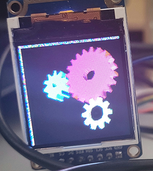

# PicoGL_gear

## 1. 关于
PicoGL在ESP32上使用的简单DEMO  

## 2. 说明
### Hardware
1. 基于TTGO-T8-V1.8(<a href="https://item.taobao.com/item.htm?id=580512912117">链接</a>)
2. 使用分辨率为128*128的1.44寸TFT屏幕,三线SPI接口(<a href="https://item.taobao.com/item.htm?id=648668064597">链接</a>)
### Software
1. 基于VScode的PlatformIO插件
2. 基于[espressif32: 3.5.0](https://github.com/platformio/platform-espressif32/releases/tag/v3.5.0)
3. 使用Arduino框架
2. 使用[TFT_eSPI](https://github.com/Bodmer/TFT_eSPI)库进行显示
### 问题
1. 设置DMA模式传输时平均帧率约为53fps,瓶颈在gear_update中的图形变换操作,每次调用花费约18ms时间。
2. 使用<a href="./test/gear.cpp.test">gear.cpp.test</a>进行测试
3. 其中最耗时间的函数为<a href="./lib/RepicoGL/list.c">list.c</a>中的glopCallList
### 参考资料
1. <a href="https://blog.kaaass.net/archives/1340">kaaass的博客</a>